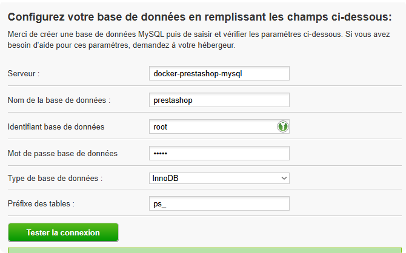

# Docker Prestashop

Version de Prestashop **volontairement** dépassée.

https://github.com/PrestaShop/docker
https://hub.docker.com/r/prestashop/prestashop/

> A Faire:
> Installer le Prestashop et créer des pages contenant le FLAG

## Lancement

```bash
docker-compose up -d
```

## Accès aux containers

Prestashop:

http://localhost:808


MySQL:

> Depuis l'hôte sur le port 3307
> > `$ mysql -uroot -padmin -h localhost --port 3307`

> Depuis un container dans le réseau avec l'url `docker-prestashop-mysql`

# Installation et configuration de Prestashop




## Utilisation en cours

* Scanner de vulnarabilités
* Scan des répertoires
* BruteForce
* Détection des versions
* Recherche de vulnérabilités
* Rédaction d'un rapport de vulnérabilités

## Versions utilisées

### Prestashop

Version 1.4

### Apache / PHP

Apache
PHP 5.6

### MySQL

Version 5.6

## Identifiants

Mysql
> root:admin

Prestashop
> demo@prestashop.com:azerty